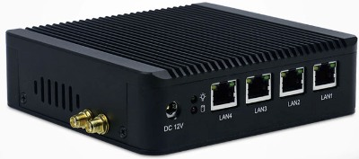
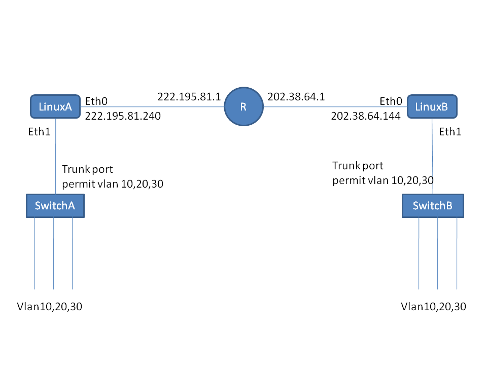

# EthUDP sample

Ethernet over UDP sample

[N10Plus多网口千兆迷你小主机](https://detail.tmall.com/item.htm?id=542409856806)

N10Plus有4个千兆接口，无风扇运行，外形如下：







On server A /etc/rc.local
````
ip add add 222.195.81.240/24 dev eth0
ip link set eth0 up
ip route add 0/0 via 222.195.81.1

ip link set eth1 mtu 1508
ip link set eth1 up

/usr/src/ethudp/EthUDP -e 222.195.81.240 6000 202.38.64.144 6000 eth1 \
	222.195.81.240 7000 202.38.64.144 7000
````

On server B /etc/rc.local
````
ip add add 202.38.64.144/24 dev eth0
ip link set eth0 up
ip route add 0/0 via 202.38.64.1

ip link set eth1 mtu 1508
ip link set eth1 up

/usr/src/ethudp/EthUDP -e 202.38.64.144 6000 222.195.81.240 6000 eth1 \
        202.38.64.144 7000 222.195.81.240 7000
````

Note: UDP port 6000 is master connection, and 7000 is slave connection.
