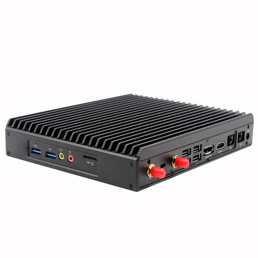

# Cross Internet, connect your ethernets
# 通过互联网桥接2个以太网段

开通视频会议时，如果某一方的视频会议终端在内网，对外经过了NAT或防火墙设备连接互联网，
另一方终端在互联网，这种情况经常会出现某个方向的音频或视频无法传送的问题。

解决问题的最简单方法是把两方的内部以太网通过互联网直接桥接，让两边的设备直通即可。

下面是我们的一个案例：

## 网络结构

站点A有公网IP，IP地址是202.110.92.27/29，网关是202.110.92.25。

站点B经过NAT连接互联网，内部IP地址是192.168.10.2/24，网关是192.168.10.1。

站点A和站点B各有一台视频会议设备，站点A的视频会议终端IP是 10.10.10.1/24，站点B的视频会议终端IP是
10.10.10.2/24。此外，站点A和站点B各设立一台Linux机器提供隧道连接，拓扑图如下：


## 使用设备

Linux机器，我们采购的是 [大唐X1L迷你电脑主机](https://detail.tmall.com/item.htm?id=553661921148)，该设备
有2个Intel以太网卡，无风扇设计，外形如下：



## 系统安装

安装CentOS 6后，执行以下命令安装EthUDP软件：
```
yum install epel-release 
yum install gcc git lz4-devel openssl-devel tcpdump ntpdate telnet traceroute
cd /usr/src
git clone https://github.com/bg6cq/ethudp.git
cd ethudp
make
```

## 站点A Linux机器的设置：

* 允许udp 6000、6001端口的通信

```
iptables -I INPUT -j ACCEPT -p udp --dport 6000
iptables -I INPUT -j ACCEPT -p udp --dport 6001
service iptables save
```
* 修改文件 `/etc/rc.d/rc.local`

```
ip link set eth0 up
ip link set eth1 up

ip add add 202.110.92.27/29 dev eth0
ip route add 0/0 via 202.110.92.25

/usr/src/ethudp/EthUDP -e 222.110.92.27 6000 0.0.0.0 0 eth1
/usr/src/ethudp/EthUDP -i 222.110.92.27 6001 0.0.0.0 0 172.16.10.1 24
````

## 站点B Linux机器的设置：

* 修改文件 `/etc/rc.d/rc.local`

```
ip link set eth0 up
ip link set eth1 up

ip add add 192.168.10.2/24 dev eth0
ip route add 0/0 via 192.168.10.1

/usr/src/ethudp/EthUDP -e 192.168.10.2 6000 202.110.92.27 6000 eth1
/usr/src/ethudp/EthUDP -i 192.168.10.2 6001 222.110.92.27 6001 172.16.10.2 24
````

## 配置说明

以上设置，站点A和站点B间的Linux机器使用UDP 6000和6001端口通信，站点B的Linux通过NAT连接站点A的Linux。

站点A的视频会议终端能直接与站点B的视频会议终端通信，就像两者直连一样。

站点A的Linux可以使用172.16.10.2与站点B的Linux通信。
